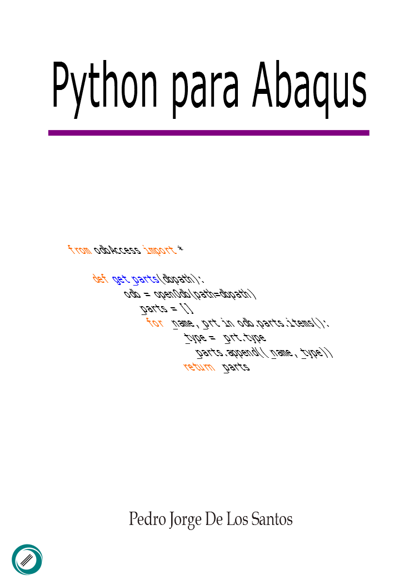

## Python para Abaqus



### Contenido

* Capítulo 1. Fundamentos de Python
* Capítulo 2. Los scripts en Abaqus
* Capítulo 3. Geometrías, secciones y materiales
* Capítulo 4. Pasos e interacciones
* Capítulo 5. Condiciones de frontera
* Capítulo 6. Mallado
* Capítulo 7. Postprocesado de archivos ODB

### Descargar PDF

[Versión actual (0.1) (En desarrollo)](https://goo.gl/O3ZBTL)


### Contribuciones / Más información

Cualquier comentario, sugerencia o corrección respecto al contenido puede informar a través de las *issues* 
o bien en cuaquiera de las siguientes medios.

```
E-mail  : delossantosmfq@gmail.com
Twitter : @pjdlsl
```

### Licencia

<a href="http://creativecommons.org/licenses/by-nc-sa/4.0/">
</a>
<br /><font size="2"> <b>Python para Abaqus</b> está liberado bajo una licencia <a rel="license" href="http://creativecommons.org/licenses/by-nc-sa/4.0/"> (CC BY-NC-SA 4.0)</a></font>
